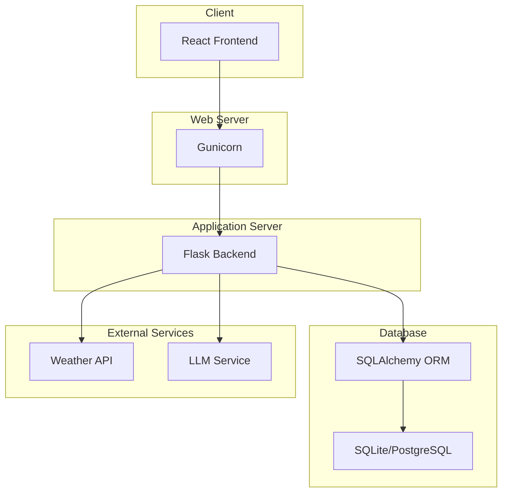

# System Architecture

This document outlines the system architecture of the Crop Stress Advisory application.

## Architecture Diagram

## Architecture Explanation

The system is designed with a classic client-server architecture, composed of the following main components:

*   **Client (React Frontend):** A single-page application (SPA) built with React. It provides the user interface for displaying weather information, submitting crop stress reports, and visualizing data. It communicates with the backend via RESTful API calls.

*   **Web Server (Gunicorn):** Gunicorn is a Python WSGI HTTP Server for UNIX. It is used as the web server in the production environment to serve the Flask application. It handles incoming HTTP requests and forwards them to the Flask application.

*   **Application Server (Flask Backend):** The core of the application is a Flask backend. It exposes several API endpoints to the frontend, processes requests, interacts with the database, and integrates with external services. It also contains the machine learning model for crop stress prediction.

*   **Database (SQLite/PostgreSQL with SQLAlchemy):** The application uses a SQL database to store crop stress reports and other application data. SQLAlchemy is used as the Object-Relational Mapper (ORM) to interact with the database. While SQLite is used for local development, a more robust database like PostgreSQL is recommended for production environments like Railway.

*   **External Services:**
    *   **Weather API:** An external weather API is used to fetch real-time weather data for a given location.
    *   **LLM Service:** The application integrates with a Large Language Model (LLM) service to provide AI-powered analysis of crop stress based on user observations.
