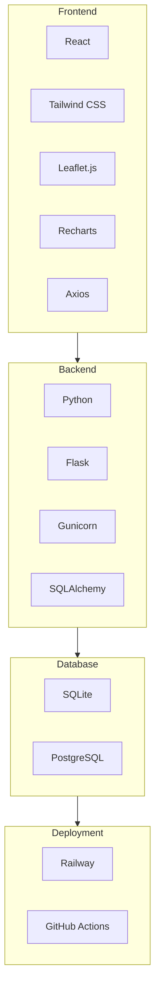

# Tech Stack

This document details the technology stack used in the Crop Stress Advisory application.

## Tech Stack Diagram

## Tech Stack Explanation

The application is built using a modern and scalable tech stack for each layer:

### Frontend

*   **React:** A JavaScript library for building user interfaces. It is used to create a responsive and interactive single-page application.
*   **Tailwind CSS:** A utility-first CSS framework for rapidly building custom user interfaces.
*   **Leaflet.js:** An open-source JavaScript library for mobile-friendly interactive maps.
*   **Recharts:** A composable charting library built on React components.
*   **Axios:** A promise-based HTTP client for the browser and Node.js, used for making API requests to the backend.

### Backend

*   **Python:** The primary programming language for the backend, chosen for its extensive libraries for data science and machine learning.
*   **Flask:** A lightweight and flexible web framework for Python.
*   **Gunicorn:** A WSGI HTTP server used to serve the Flask application in production.
*   **SQLAlchemy:** An SQL toolkit and Object-Relational Mapper (ORM) that gives application developers the full power and flexibility of SQL.

### Database

*   **SQLite:** A C-language library that implements a small, fast, self-contained, high-reliability, full-featured, SQL database engine. It is used for local development.
*   **PostgreSQL:** A powerful, open-source object-relational database system. It is recommended for production environments.

### Deployment

*   **Railway:** A modern application hosting platform that makes it easy to deploy and scale applications.
*   **GitHub Actions:** A CI/CD platform that automates the build, test, and deployment pipeline.
